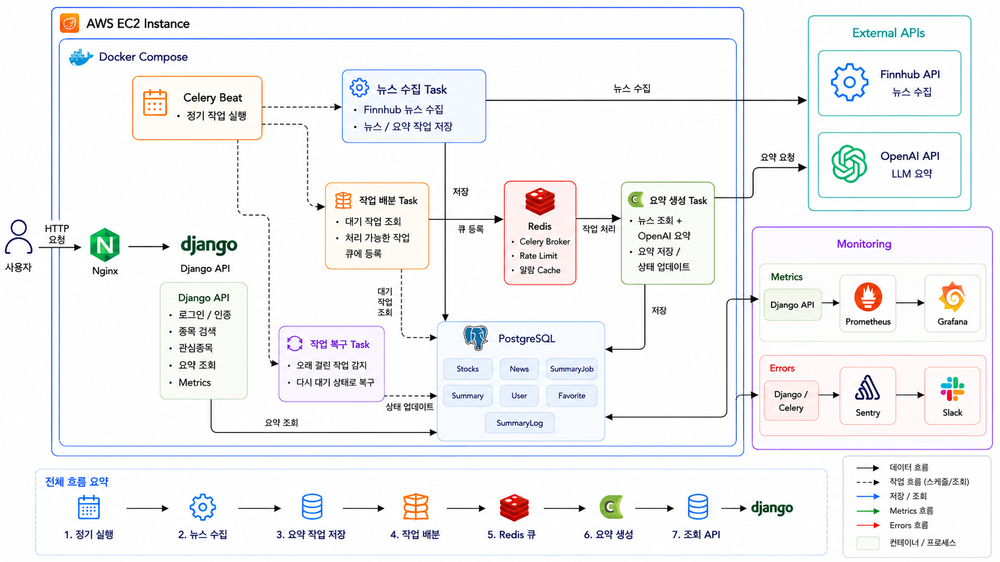
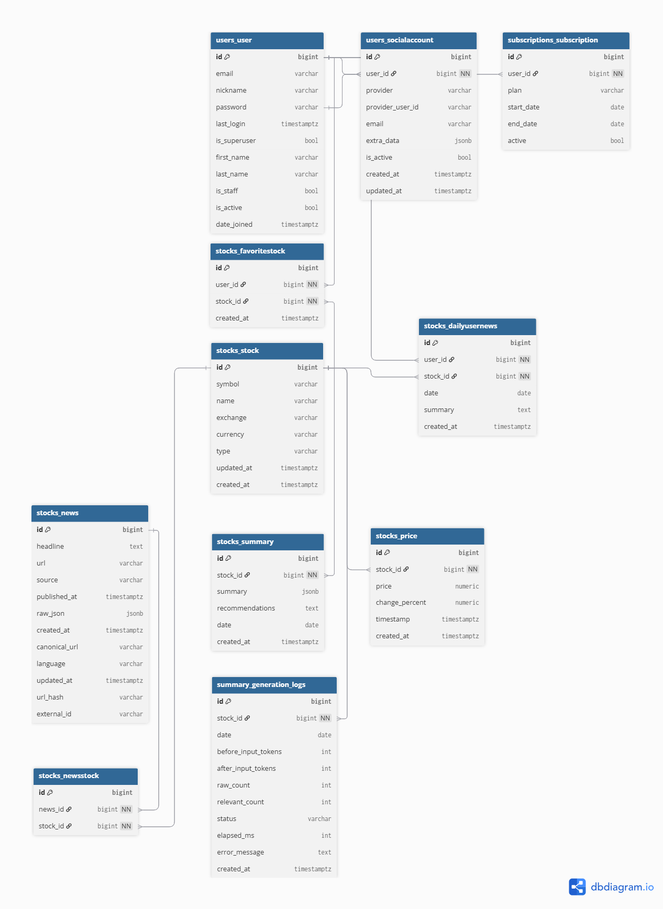
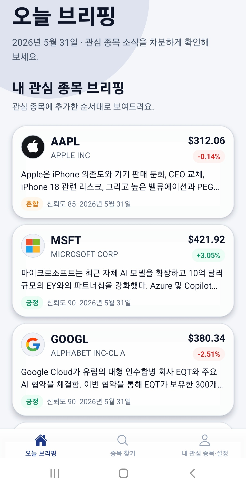
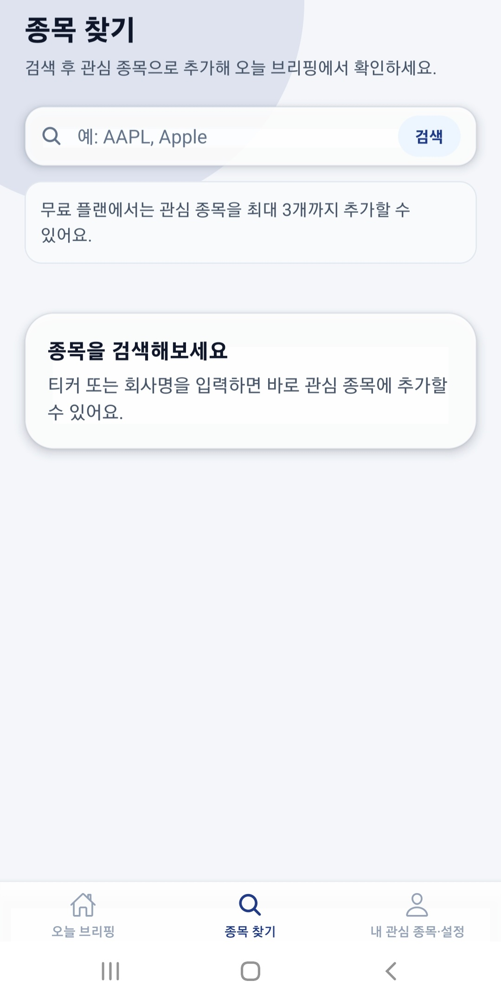
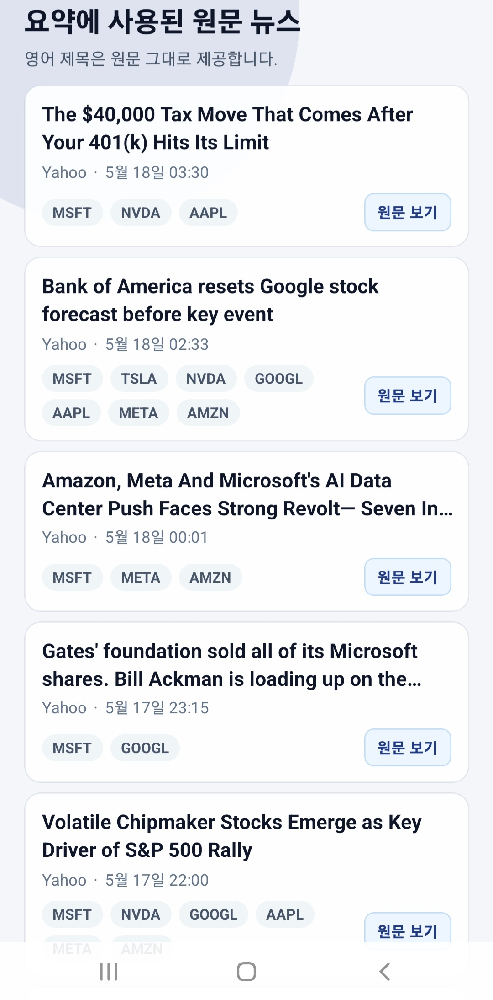
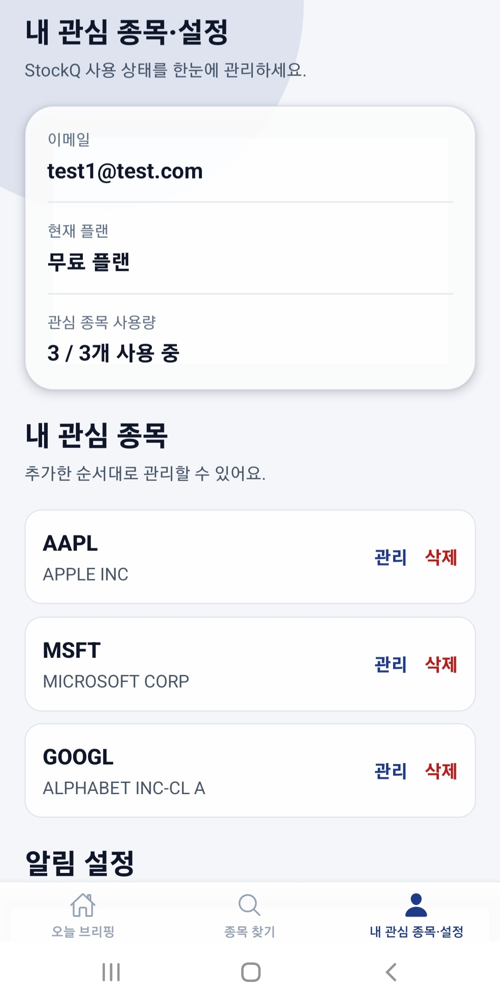

## 소개

원하는 주식을 즐겨찾기에 등록하면 매일 아침 종목별 요약을 받아볼 수 있는 서비스입니다.

## 기술 스택

| 구분 | 기술 |
|---|---|
| Backend | Python, Django, Django REST Framework |
| Database | PostgreSQL |
| Cache / Broker | Redis |
| Async / Batch | Celery, Celery Beat |
| External API | Finnhub API, OpenAI API |
| Infra / Deploy | Docker, Docker Compose, Nginx, Gunicorn, AWS EC2, GitHub Actions |
| Monitoring | Prometheus, Grafana, Slack Alert, Sentry |
| Test / Performance | pytest, k6, Django Debug Toolbar |

## 아키텍처

## ERD

## 화면

## 트러블슈팅 & 성능 최적화

### 1. Queue 적체 해결 — Backpressure 적용

**문제**
LLM 요약 작업을 백그라운드로 분리하기 위해 Celery를 도입했지만 생성된 Job을 한꺼번에 Queue에 넣다 보니 Worker가 처리할 수 있는 양을 초과해 대기 시간이 폭증했습니다.

**원인 파악**
Queue에 넣는 속도와 Worker가 소화하는 속도 사이의 균형이 없었던 것이 문제였습니다.

**해결**
Dispatcher가 현재 실행 중인 Job 수를 확인하고 빈 슬롯만큼만 새 작업을 내보내도록 변경했습니다. 생산자가 소비자의 처리 속도에 맞춰 속도를 조절하는 방식(Backpressure)입니다.

**결과**
Queue 대기 시간이 **최대 9.3초 → 0.03~0.24초**로 안정화됐습니다.

### 2. 직렬화 병목 발견 및 N+1 쿼리 제거

**문제**
주식 검색 API의 응답이 약 1.7초에 달했습니다. 처음엔 DB 쿼리가 느린 것으로 예상했습니다.

**원인 파악**
Django Debug Toolbar로 실측한 결과 SQL 실행 자체는 6ms로 빠른데 수백 개의 객체를 한꺼번에 직렬화하고 Browsable API가 이를 렌더링하는 과정이 진짜 병목이었습니다. 또한 객체마다 추가 쿼리를 발생시키는 N+1 문제도 함께 있었습니다.

**해결**
- 페이지네이션(`CursorPagination`) 도입으로 한 번에 반환하는 객체 수를 제한
- 즐겨찾기 여부와 최신 가격을 객체마다 따로 조회하던 구조를 `Exists`, `Subquery` annotation으로 변경해 N+1 쿼리를 제거

**결과**
검색 API 응답 시간을 **1,750ms → 37ms**로 개선했습니다.

### 3. 외부 API Rate Limit 대응 — Redis Token Bucket 기반 호출 제어

**문제**
뉴스 수집 과정에서 여러 종목의 Finnhub API 호출이 짧은 시간에 몰리면서 429 에러가 발생했습니다. 또한 OpenAI 요약 생성도 외부 API 호출이므로 작업이 몰릴 경우 요청이 연속적으로 발생할 수 있었습니다.

**원인 파악**
외부 API 호출은 Worker 수가 늘어나거나 여러 작업이 동시에 실행될 때 한꺼번에 몰릴 수 있습니다. 기존 구조에는 호출 가능 여부를 중앙에서 판단하고 허용량을 초과한 요청을 대기 또는 재시도 흐름으로 넘기는 장치가 부족했습니다.

**해결**
Redis + Lua 기반 token bucket을 적용해 Finnhub와 OpenAI API 호출 전에 호출 가능 여부를 원자적으로 확인하도록 했습니다. `capacity`는 순간 burst를 제한하고, `refill_rate`는 장기적인 호출 속도를 제한하는 값으로 분리했습니다. 현재 기본값은 작은 운영 환경에서 순간 burst를 보수적으로 제한하기 위한 초기값이며 환경 변수로 조정할 수 있습니다.

여기서 Redis token은 OpenAI의 텍스트 token이 아니라 외부 API 호출을 허용하기 위한 요청 slot입니다. OpenAI에는 요청당 slot 1개를 차감하므로 TPM(tokens per minute) 제어가 아닌 요청 단위 rate control을 적용합니다. 같은 Redis token bucket 판정 구조를 사용하되, 후속 처리는 작업 특성에 맞게 분리했습니다. OpenAI 요약 작업은 장시간·고비용 `SummaryJob` 기반 작업이므로 slot 부족 시 `RETRY_WAIT`로 전환합니다. Finnhub 호출은 API 호출 전 Redis token bucket으로 slot을 확인하고, 실제 429 응답에는 exponential backoff와 jitter로 재시도하도록 처리했습니다.

**결과**
Finnhub API의 429 상황에 대응할 수 있었고, OpenAI 요약 작업도 요청 단위 slot 제어를 통해 짧은 시간에 외부 API 호출이 몰리는 상황을 완화했습니다.

### 4. Worker 장애 시 Stuck Job 자동 복구

**문제**
Worker가 죽거나 네트워크 타임아웃이 발생하면 처리 중이던 Job이 `RUNNING` 상태로 계속 남아 다시 처리되지 않는 문제가 있었습니다.

**해결**
Job에 마지막 상태 갱신 시각을 기록해두고 일정 시간 이상 갱신되지 않은 Job을 Stuck으로 판단해 자동 재처리하도록 했습니다. 이때 오래된 Worker가 뒤늦게 결과를 덮어쓰는 문제를 막기 위해 각 처리 시도마다 고유 토큰(`lease_token`)을 발급해 유효한 Worker의 결과만 반영되도록 했습니다.
